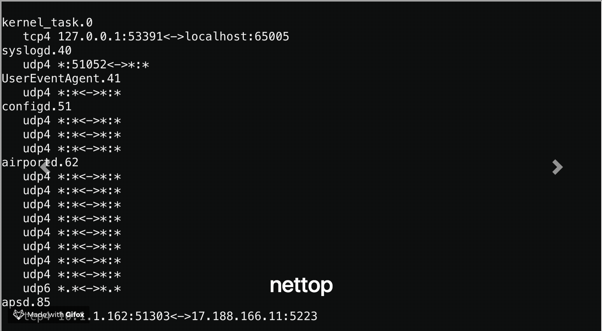

# iframe-carousel

[](https://travis-ci.org/thebentern/iframe-carousel)

An express app for displaying external pages in iframes on a carousel for a kiosk or dashboard 



## Requirements

For development:

* [NodeJs / npm](https://nodejs.org/en/)

Optional 
* For better npm package management [Yarn](https://yarnpkg.com/en/)
* For running inside a container [Docker](https://www.docker.com/get-docker)

## Basic installation and usage

* Clone the repository

* Open a terminal in the `src/` directory

* Run `yarn install` to install dependencies

* Edit the `slides.yml` configuration:

### Carousel slide config

In the workspace `src/` folder, there is a file `slides.yml` which can be used to control the iframe slides and the transition time between them.

```yaml
# Transition time is expressed in milliseconds
transition_time: 10000
# Slides have a url and optional title
slides:
  - title: Googley moogly
    url: https://google.com
  - title: Bing
    url: https://bing.com
```

* Run `npm start` to run the application on http://localhost:3000

## Building and running in Docker

Optionally, you can run a containerized version of the application. Follow the steps above.

* Run `docker build -t iframe-carousel .` to build the docker image

* Run `docker run -p 3000:3000 -d iframe-carousel` to run the docker image on port 3000.
